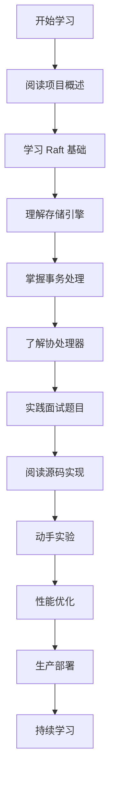

# TiKV Learning Project

> 一个深入学习 TiKV 分布式键值数据库的学习项目

## 📖 项目简介

本项目旨在帮助开发者深入理解 TiKV 的核心架构和实现原理。TiKV 是一个开源的分布式事务型键值数据库，基于 Rust 语言构建，使用 Raft 分布式一致性算法来保证数据一致性。

### 🎯 学习目标

- 理解分布式系统的核心概念
- 掌握 Raft 分布式一致性算法
- 深入了解 TiKV 的架构设计和实现细节
- 学习分布式事务处理和存储引擎技术
- 掌握分布式系统的故障处理和性能优化

## 📚 文档结构

### 📁 核心模块文档

| 文档 | 描述 |
|------|------|
| [01-项目概述.md](docs/01-项目概述.md) | TiKV 整体架构介绍、技术特性和生态系统 |
| [02-Raftstore模块详解.md](docs/02-Raftstore模块详解.md) | Raftstore 模块的详细实现，包括状态机设计 |
| [03-存储引擎模块详解.md](docs/03-存储引擎模块详解.md) | 存储引擎抽象层和 RocksDB 集成实现 |
| [04-事务处理模块详解.md](docs/04-事务处理模块详解.md) | 分布式事务处理和 MVCC 实现 |
| [05-协处理器模块详解.md](docs/05-协处理器模块详解.md) | Coprocessor 框架和 DAG 执行引擎 |

### 📁 Raft 算法学习系列

| 文档 | 难度 | 描述 |
|------|------|------|
| [博客-深入理解Raft分布式一致性算法.md](docs/博客-深入理解Raft分布式一致性算法.md) | 基础 | Raft 算法完整介绍和实现原理 |
| [博客-Raft基础面试题详解.md](docs/博客-Raft基础面试题详解.md) | 初级 | Raft 基础概念和常见面试问题 |
| [博客-Raft进阶面试题详解.md](docs/博客-Raft进阶面试题详解.md) | 中级 | Raft 高级特性和优化技术 |
| [博客-Raft硬核面试题详解.md](docs/博客-Raft硬核面试题详解.md) | 高级 | Raft 理论基础和数学证明 |
| [博客-TiKV Raft实现面试题详解.md](docs/博客-TiKV Raft实现面试题详解.md) | 专家级 | TiKV 中 Raft 的实际实现和生产经验 |

## 🚀 快速开始

### 📋 前置知识

建议在开始学习前具备以下基础知识：

- **Rust 编程语言**: TiKV 主要使用 Rust 开发
- **分布式系统基础**: 了解 CAP 理论、分布式共识等概念
- **数据库基础**: 理解事务、索引、存储引擎等概念
- **网络编程**: 了解 RPC、网络协议等

### 📖 学习路径建议

#### 1. 基础入门路径
```
项目概述 → Raft 算法基础 → 存储引擎 → 事务处理 → 协处理器
```

#### 2. 深入学习路径
```
Raft 基础面试 → Raft 进阶面试 → Raft 硬核面试 → TiKV Raft 实现
```

#### 3. 实践开发路径
```
阅读源码 → 运行测试 → 修改实验 → 性能优化 → 故障注入
```

## 🛠️ 技术栈

### 核心技术
- **Rust**: 系统编程语言，保证内存安全和并发安全
- **Raft**: 分布式一致性算法
- **RocksDB**: 嵌入式键值存储引擎
- **gRPC**: 远程过程调用框架

### 依赖组件
- **etcd**: 服务发现和配置管理
- **Prometheus**: 监控指标收集
- **Jaeger**: 分布式追踪
- **PD (Placement Driver)**: 集群调度和管理

## 🔧 开发环境

### 系统要求
- Rust 1.70+
- Linux/macOS
- 8GB+ RAM
- 50GB+ 磁盘空间

### 构建步骤

```bash
# 克隆项目
git clone https://github.com/your-username/tikv-learning.git
cd tikv-learning

# 编译项目
cargo build --release

# 运行测试
cargo test

# 运行基准测试
cargo bench
```

## 📊 核心模块

### Raftstore 模块
- **Peer FSM**: 处理 Raft 协议相关事件
- **Apply FSM**: 处理日志应用和状态机更新
- **Store FSM**: 管理整个存储节点的状态
- **Snap Manager**: 处理快照的创建和管理

### 存储引擎模块
- **Engine Trait**: 存储引擎抽象接口
- **RocksDB 实现**: 基于 RocksDB 的存储引擎实现
- **MVCC**: 多版本并发控制
- **事务管理**: 分布式事务处理

### 协处理器模块
- **DAG 引擎**: 分布式执行计划处理
- **表达式计算**: SQL 表达式求值
- **聚合操作**: 分布式聚合计算
- **索引操作**: 二级索引处理

## 🎯 学习重点

### 分布式一致性
- Raft 算法的实现细节
- Leader 选举和日志复制
- 线性一致性保证
- 故障恢复机制

### 性能优化
- 日志压缩技术
- 批量处理优化
- 流水线复制
- 缓存策略

### 生产实践
- 集群部署和运维
- 监控和告警
- 故障诊断和处理
- 性能调优

## 📝 贡献指南

欢迎参与贡献！请遵循以下步骤：

1. Fork 本项目
2. 创建特性分支 (`git checkout -b feature/AmazingFeature`)
3. 提交更改 (`git commit -m 'Add some AmazingFeature'`)
4. 推送到分支 (`git push origin feature/AmazingFeature`)
5. 打开 Pull Request

### 贡献类型
- 📝 文档改进和补充
- 🐛 Bug 修复
- ✨ 新功能添加
- 🧪 测试用例完善
- 📚 示例代码添加

## 📄 许可证

本项目基于 MIT 许可证开源 - 详见 [LICENSE](LICENSE) 文件。

## 🙏 致谢

- [TiKV 官方项目](https://github.com/tikv/tikv)
- [Raft 算法论文](https://raft.github.io/raft.pdf)
- 所有参与贡献的开发者

## 🗺️ 学习路线图



---

*祝你学习愉快！如果在学习过程中遇到任何问题，欢迎随时提出 Issue 或参与讨论。*